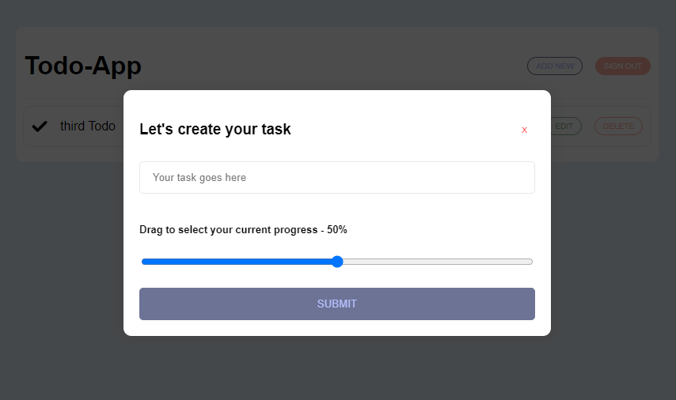

# Todo App

This is a full-stack Todo application built with React.js on the frontend and Express.js with Node.js on the backend. The app features user authentication, protected routes, and CRUD operations for managing todos. This is a simple todo app.

## Features

- **User Authentication**: Secure authentication using JWT and bcrypt.
- **Protected Routes**: Routes are protected and accessible only after login.
- **Todo Management**: Add, edit, delete, and view your todos.
- **Persistent Sessions**: User sessions are managed using JWT and react-cookie.

## Tech Stack

- **Frontend**:

  - React.js
  - React Router

- **Backend**:
  - Node.js
  - Express.js
  - bcrypt (for password hashing)
  - JWT (for authentication)
  - uuid (for unique identifiers)
  - PostgreSQL (for data storage)

## Installation

### Prerequisites

Make sure you have the following installed:

- Node.js
- npm or yarn
- PostgreSQL

### Backend Setup

1. Clone the repository:

   ```bash
   git clone https://github.com/your-username/todo-app.git
   cd todo
   ```

2. Navigate to the backend directory:

   ```bash
   cd server
   ```

3. Install the dependencies:

   ```bash
   npm install
   ```

4. Set up your environment variables. Create a `.env` file in the backend directory with the following:

   ```
   PORT=5294
   DB_PORT=5294
   DB_USERNAME=YOUR_USERNAME
   SECRET_KEY=your_jwt_secret
   ```

5. Start the backend server:

   ```bash
   npm start
   ```

### Frontend Setup

1. Navigate to the frontend directory:

   ```bash
   cd client
   ```

2. Install the dependencies:

   ```bash
   npm install
   ```

3. Start the React development server:

   ```bash
   npm start
   ```

4. Open your browser and go to `http://localhost:5173`.

## Usage

1. **Authentication**:

   - 

2. **Todo List**:

   - 

3. **Add Todo**:

   - 

4. **Edit Todo**:
   - 

## Contributing

Feel free to submit issues or pull requests for any improvements or features.
